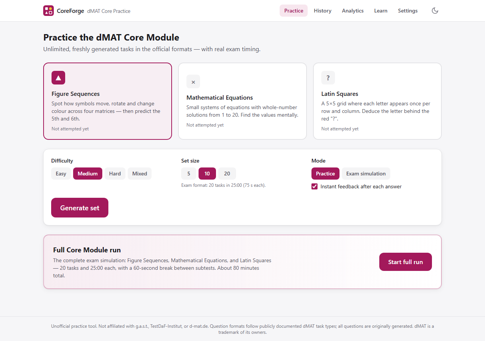
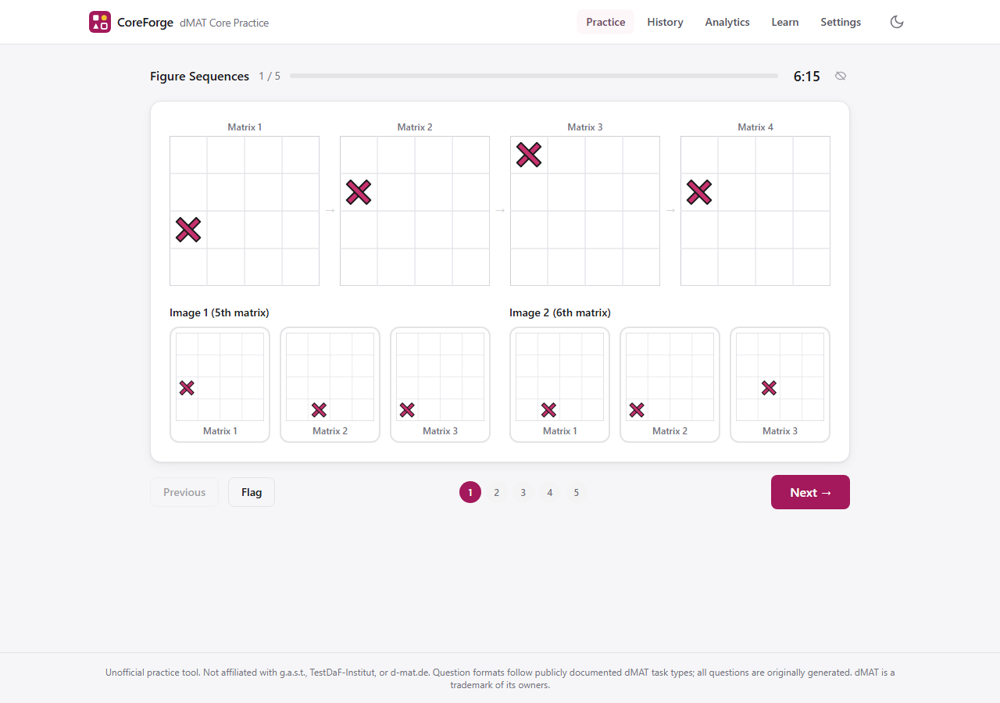
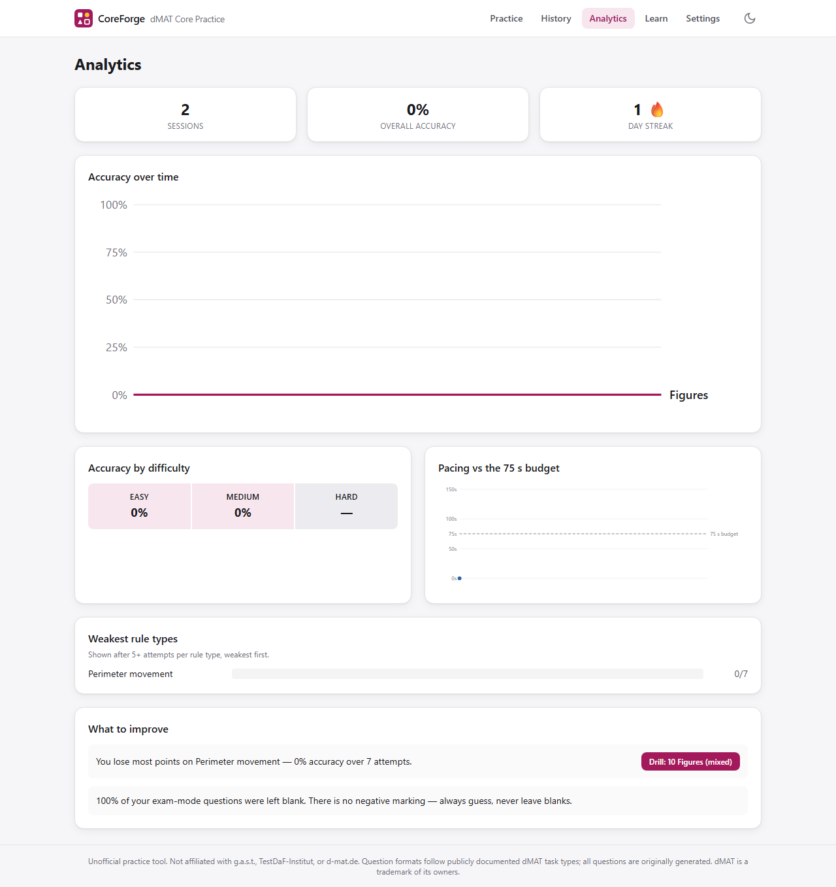

# dMAT Practice — Free Core Module Test Simulator (Figure Sequences · Equations · Latin Squares)

**Practice the dMAT (digitaler Mastertest) Core Module for free, with unlimited questions and real
exam timing.** CoreForge is a free dMAT practice platform covering all three Core Module subtests —
**Figure Sequences (Figurenreihen), Mathematical Equations, and Latin Squares** — in the official
format: 20 tasks in 25 minutes, single choice, no note-taking.

### ▶ [**Start practicing now — free account (Google or email), nothing to install**](https://golden007-prog.github.io/DMAT_Core_Module_with_Free_Gemini_key/)

[](https://golden007-prog.github.io/DMAT_Core_Module_with_Free_Gemini_key/)
[](LICENSE)



## Who is this for?

Anyone preparing for the **dMAT** — the standardized aptitude test by **g.a.s.t. / TestDaF-Institut**
required for admission to many **German Master's programmes**. From 2026 the dMAT is also part of
**APS verification for applicants from India** (engineering, computer science, and business fields,
Summer Semester 2027 intakes onward). Official material offers only ~6 example exercises per task
type; this simulator gives you **unlimited, freshly generated practice** in exactly the same formats.

Searching for any of these? You're in the right place:
*dMAT practice test · dMAT Core Module · digitaler Mastertest Übung · dMAT Figurenreihen practice ·
dMAT preparation free · g.a.s.t. Mastertest practice · dMAT test simulator · APS dMAT India*

## What you get

| | |
|---|---|
| **Three exam-faithful subtests** | 4×4 figure matrices (predict the 5th & 6th frame), equation systems with whole-number solutions 1–20, and 5×5 Latin squares with the red "?" cell |
| **Real exam timing** | 20 tasks / 25:00 per subtest (75 s per task), drift-free timer, auto-submit, and a full 3-subtest exam run with 60-second breaks |
| **Unlimited questions** | Every set is freshly generated and machine-validated — never a broken question, never a wrong answer key |
| **Instant feedback + explanations** | Step-by-step deterministic solutions, rule breakdowns, and an animated sequence replay for figure tasks |
| **Weekly rankings & leagues** | Difficulty-weighted points (10/20/35 per correct, ×1.15 for mixed sets) plus an under-time bonus of up to +50%; climb Bronze → Silver → Gold → Diamond → Legend on a leaderboard that resets every Monday (UTC) |
| **Progress analytics** | Accuracy trends, weakness detection by rule type (e.g. "x+1 acceleration", "hidden singles"), pacing vs the 75 s budget, streaks, and concrete drill suggestions |
| **Retry tools** | Replay the exact same set (seeded), or auto-build a set from your past mistakes |
| **Cross-device sync** | Sign in once (Google or email): history, settings, and your Gemini key follow you everywhere, stored in your own access-controlled rows |
| **Community question pool** | AI-generated questions are shared (content-hash deduplicated — the same question is never stored twice) so even users without an API key get fresh AI variety, instantly |
| **Works offline** | Installable PWA; the full generator runs in your browser — after signing in once, practice works without a connection |
| **Optional free AI tutor** | Bring your own free Gemini API key for freshly generated equation sets and per-mistake tutor explanations — [get a free key](https://aistudio.google.com/apikey), enter it once, it syncs with your account |



## Why trust the questions?

Most practice sites hand-write a few dozen questions. CoreForge **generates and proves** each one:

- Every question passes a **programmatic validator** before you see it: exactly one correct answer,
  distinct plausible distractors, solvable under the official rule system.
- Figure tasks pass an **inferability check** — the moving/rotating/colour rules must be uniquely
  deducible from the four visible frames, or the task is regenerated.
- Equation systems are **brute-force proven** to have exactly one solution in 1–20.
- Latin squares are verified so that **every valid completion agrees** on the "?" cell, and the
  deduction depth matches the difficulty band.
- AI-generated questions go through the **same validators locally** before they're used or shared —
  invalid output is silently replaced by the deterministic generator.



## How the points work

- Each correct answer: **10** (easy) · **20** (medium) · **35** (hard); mixed sets ×1.15.
- Finish under the time budget with every question answered → up to **+50% bonus**, proportional
  to the time saved. Wrong or blank answers earn nothing — accuracy first, speed second.
- Points accumulate per ISO week (UTC) into a shared leaderboard with five leagues:
  **Bronze** 0+ · **Silver** 300+ · **Gold** 800+ · **Diamond** 1600+ · **Legend** 3000+.

## Tech

React 19 · TypeScript · Vite · Tailwind CSS v4 · Zustand · Dexie (IndexedDB, local-first) ·
Supabase (auth + sync + leaderboard, row-level security on every table) · optional Gemini API
(user's own free key) · PWA. Deployed to GitHub Pages by the included workflow on every push.

```bash
npm install
npm run dev      # local dev server
npm run build    # static production build in dist/
```

## FAQ

**Is this the official dMAT test?** No. This is an independent, unofficial practice tool. For
official information and the original example exercises, visit [d-mat.de](https://www.d-mat.de).

**Does a good score here guarantee a good dMAT score?** No — the real dMAT reports a standardised
0–200 score that cannot be derived from practice accuracy. The app uses an honest ≥85% accuracy
heuristic for readiness and says so in the UI.

**Is it really free?** Yes — MIT-licensed, static hosting, no ads, no tracking. A free account
(Google or email) keeps your progress synced and powers the leaderboard. The optional AI features
use *your own* free-tier Gemini key.

**Can I practice on my phone?** Yes — the whole exam flow is responsive and keyboard/touch friendly,
and the app installs as a PWA for offline use.

## License & disclaimer

[MIT](LICENSE). Unofficial practice tool — not affiliated with g.a.s.t., TestDaF-Institut, or
d-mat.de. Question formats follow publicly documented dMAT task types; **all questions are
originally generated**. dMAT is a trademark of its owners.
