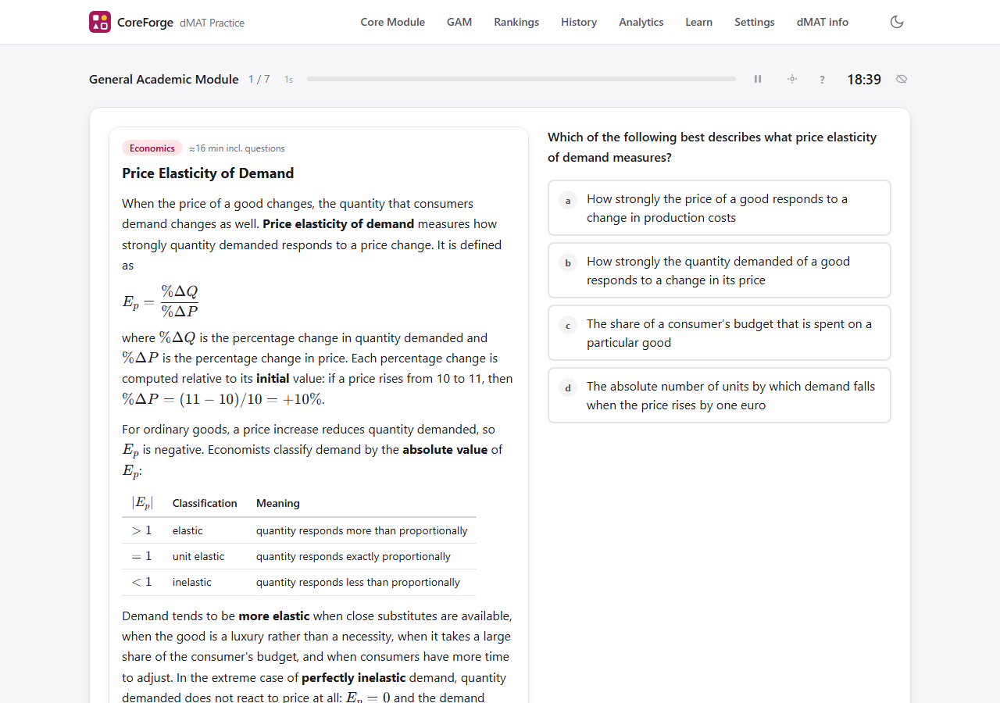
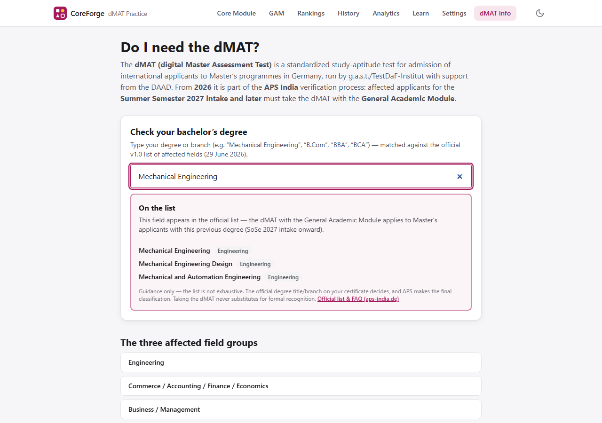

# DMAT Practice — Free Complete Test Simulator (Core Module + General Academic Module)

**Practice the complete dMAT (digitaler Mastertest) for free, with unlimited questions and real
exam timing.** CoreForge covers both parts of the test: the **Core Module** — Figure Sequences
(Figurenreihen), Mathematical Equations, and Latin Squares, 20 tasks in 25 minutes each — and the
**General Academic Module (GAM)**, the 90-minute Subject Module of passage-based single-choice
questions across eight academic fields that affected Indian applicants need from the Summer
Semester 2027 intake.

### ▶ [**Start practicing now — free account (Google or email), nothing to install**](https://golden007-prog.github.io/DMAT_Core_Module_with_Free_Gemini_key/)

[](https://golden007-prog.github.io/DMAT_Core_Module_with_Free_Gemini_key/)
[](LICENSE)


## Who is this for?

Anyone preparing for the **dMAT** — the standardized aptitude test by **g.a.s.t. / TestDaF-Institut**
required for admission to many **German Master's programmes**. From 2026 the dMAT is also part of
**APS verification for applicants from India**: Master's applicants whose previous degree falls into
**Engineering**, **Commerce / Accounting / Finance / Economics**, or **Business / Management** take
the dMAT with the General Academic Module for Summer Semester 2027 intakes onward. (Standalone
Computer Science, BCA, and IT degrees are **not** automatically covered — only Engineering branches
such as "Computer Science and Engineering" are; the in-app
[**"Do I need the dMAT?" checker**](https://golden007-prog.github.io/DMAT_Core_Module_with_Free_Gemini_key/dmat-info)
ships the complete official v1.0 affected-fields list.) Official material offers only a handful of
example exercises per task type; this simulator gives you **unlimited, freshly generated practice**
in exactly the same formats.

Searching for any of these? You're in the right place:
*dMAT practice test · dMAT Core Module · dMAT General Academic Module practice · digitaler
Mastertest Übung · dMAT Figurenreihen practice · dMAT preparation free · g.a.s.t. Mastertest
practice · dMAT test simulator · APS dMAT India*

## What you get

| | |
|---|---|
| **The complete dMAT** | Both modules in one free app: three Core subtests plus the General Academic Module, and a full 3.5-hour dMAT simulation — Core, the official 30-minute module break, then GAM at 90:00 |
| **Three exam-faithful Core subtests** | 4×4 figure matrices (predict the 5th & 6th frame), equation systems with whole-number solutions 1–20, and 5×5 Latin squares with the red "?" cell — practise them with letters, digits, Greek letters, or shapes |
| **General Academic Module practice** | 16 original passages (105 questions) across all eight official topic areas — mathematics to humanities — with topic drills, timed sets, and the full 90:00 GAM exam; split passage/question view on desktop, a reading-friendly toggle on phones |
| **Real exam timing** | 20 tasks / 25:00 per Core subtest (75 s per task), 90:00 for GAM, drift-free timer, auto-submit, and breaks exactly like test day |
| **Unlimited questions** | Every Core set is freshly generated and machine-validated; every GAM answer key survived an independent re-derivation check — never a broken question, never a wrong key |
| **Instant feedback + explanations** | Step-by-step deterministic solutions, rule breakdowns, worked GAM solutions, and an animated sequence replay for figure tasks |
| **Weekly rankings & leagues** | Difficulty-weighted points (10/20/35 per correct, ×1.15 for mixed sets) plus an under-time bonus of up to +50%; climb nine leagues from Bronze to Immortal (16000+) on a leaderboard with Core / GAM / Combined views that resets every Monday (UTC) |
| **Progress analytics** | Accuracy trends, weakness detection by rule type and GAM topic area, pacing vs the 75 s / 160 s budgets, streaks, and one-tap drills for your two weakest areas |
| **Retry tools** | Replay the exact same set (seeded), drill your all-time mistakes notebook, or auto-build a set from a session's errors — passages included |
| **"Do I need the dMAT?" checker** | The complete official v1.0 affected-fields list (all 129 Engineering branches plus every Commerce and Business entry) as a fuzzy search — with the official nuances for CS/IT, Biotech, and sector-specific management degrees |
| **Achievements & streaks** | Badges, a daily goal ring, a practice calendar, and a countdown to the next official India test date |
| **Cross-device sync** | Sign in once (Google or email): history, settings, and your Gemini key follow you everywhere, stored in your own access-controlled rows |
| **Community question pool** | AI-generated questions and GAM passages are shared (content-hash deduplicated) so even users without an API key get fresh AI variety, instantly |
| **Works offline** | Installable PWA; the generators and the full GAM bank run in your browser — after signing in once, practice works without a connection |
| **Optional free AI tutor** | Bring your own free Gemini API key for freshly generated equation sets, brand-new GAM passages in your weakest topic, and per-mistake tutor explanations — [get a free key](https://aistudio.google.com/apikey) |




## Why trust the questions?

Most practice sites hand-write a few dozen questions. CoreForge **generates and proves** each one:

- Every question passes a **programmatic validator** before you see it: exactly one correct answer,
  distinct plausible distractors, solvable under the official rule system.
- Figure tasks pass an **inferability check** — the moving/rotating/colour rules must be uniquely
  deducible from the four visible frames, or the task is regenerated.
- Equation systems are **brute-force proven** to have exactly one solution in 1–20.
- Latin squares are verified so that **every valid completion agrees** on the "?" cell, and the
  deduction depth matches the difficulty band.
- Every GAM passage is validated structurally (exactly 4 options, one correct, resolvable figures,
  parseable math) and its **answer keys were independently re-derived** question by question before
  shipping; the one defect that process caught was fixed before release.
- AI-generated content goes through the **same validators locally** before it is used or shared —
  invalid output is silently replaced by the built-in generators and bank.




## How the points work

- Each correct answer: **10** (easy) · **20** (medium) · **35** (hard); mixed sets ×1.15.
- Finish under the time budget with every question answered → up to **+50% bonus**, proportional
  to the time saved. Wrong or blank answers earn nothing — accuracy first, speed second.
- Points accumulate per ISO week (UTC) into a shared leaderboard with nine leagues:
  **Bronze** 0+ · **Silver** 300+ · **Gold** 800+ · **Diamond** 1600+ · **Legend** 3000+ ·
  **Master** 5000+ · **Grandmaster** 8000+ · **Champion** 12000+ · **Immortal** 16000+ —
  filterable by Core, GAM, or Combined.
- Exam integrity: leaving a running exam (navigating away, closing the tab) deletes the attempt —
  unfinished exams are never scored, saved, or resumable. Practice sessions survive refreshes.

## Tech

React 19 · TypeScript · Vite · Tailwind CSS v4 · Zustand · Dexie (IndexedDB, local-first) ·
Supabase (auth + sync + leaderboard, row-level security on every table) · KaTeX (lazy-loaded math)
· optional Gemini API (user's own free key) · PWA. Deployed to GitHub Pages by the included
workflow on every push.

```bash
npm install
npm run dev      # local dev server
npm run build    # static production build in dist/
```

## FAQ

**Is this the official dMAT test?** No. This is an independent, unofficial practice tool. For
official information and the original example exercises, visit [d-mat.de](https://www.d-mat.de/en/)
and [aps-india.de/dmat](https://aps-india.de/dmat/).

**Do I need to take the dMAT?** If you're an Indian Master's applicant with a previous degree in
Engineering, Commerce/Accounting/Finance/Economics, or Business/Management, applying for Summer
Semester 2027 or later — yes, with the General Academic Module, as part of the APS process. The
in-app checker searches the complete official affected-fields list; exemptions apply (e.g. APS
registration before 29 June 2026). The checker is guidance only — APS decides.

**Are these real GAM questions?** No — no practice tool has those, and official samples note their
difficulty "does not necessarily reflect" the real test. Every passage here is original content in
the officially documented format: a passage that teaches, then single-choice questions that make
you apply, compute, and transfer.

**Does a good score here guarantee a good dMAT score?** No — the real dMAT reports a standardised
0–200 score that cannot be derived from practice accuracy. The app uses an honest ≥85% accuracy
heuristic for readiness (and a clearly-labeled indicative figure after full simulations) and says
so in the UI.

**Is it really free?** Yes — MIT-licensed, static hosting, no ads, no tracking. A free account
(Google or email) keeps your progress synced and powers the leaderboard. The optional AI features
use *your own* free-tier Gemini key.

**Can I practice on my phone?** Yes — the whole exam flow is responsive and keyboard/touch
friendly, including a reading-friendly passage/question toggle for GAM, and the app installs as a
PWA for offline use.

## License & disclaimer

[MIT](LICENSE). Unofficial practice tool — not affiliated with g.a.s.t., TestDaF-Institut, APS,
the DAAD, or d-mat.de. Question formats follow publicly documented dMAT task types; **all questions
are originally generated**. Facts about the India/APS requirement are stated as of July 2026 —
verify against the official sources. dMAT is a trademark of its owners.
